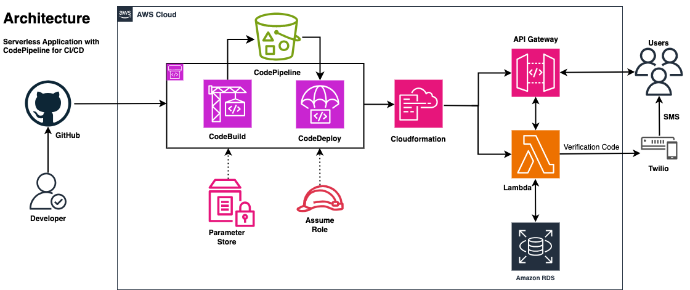

<div align="center">
	<a></a>
	<a></a>
</div>

<p align="center">
	<a></a>
	<a></a>
	<a></a>
  <a></a>
	<a></a>
	
</p>

# Serverless Application with Node.js and AWS

## Product Requirements

- Serverless Application
- Users can register, login and view their profile

## System Design

<p align="center">
  
</p>

### Functional Requirements
- User register and login
- User verfication with OTP/SMS
  
### Non-Functional Requirements
### Database Requirements

## Tech Stack
- Node.js
- Typescript
- AWS Lambda
- Serverless Framework
- PostgreSQL
- REST API
- Docker
- - AWS CodePipeline (CI/CD)
- AWS Parameter Store

## Usage

### Deployment

Install dependencies:

```
npm install
```

deploy locally:

```
make start_db 	# start Docker with PostgreSQL
npm run dev
```

deploy locally and generate swagger:

```
make start_db 	# start Docker with PostgreSQL
npm run start
```
swagger will be available at `https://{base-url}/swagger`


deploy to the cloud manually:

```
npm run deploy
```

### CI/CD with CodePipeline

- Push your changes and merge the branch into `master`.
- CodeBuild pulls the changes and uses `buildspec.yml` to create a new build. CodeDeploy deploys the new build.


